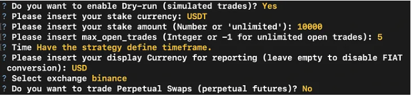
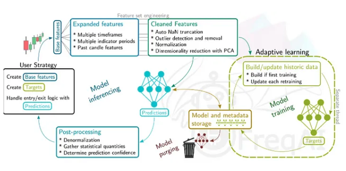
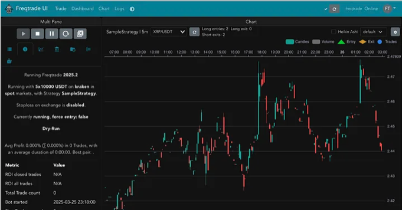

# AI and Crypto Trading: The Next Step in Financial Markets

## Introduction

The financial sector has emulated trends from various industries, adapting their technologies and developments. One such innovation is narrated by Michael Lewis (2014) in his book Flash Boys, where he describes how, in the early 2000s, an investment firm ventured into building a fiber-optic network to gain milliseconds in the time it took to send information from New York to Chicago, allowing them to close trades with better margins. This exemplifies how the financial sector leverages technology to increase profits.

More recently, companies involved in financial markets, aiming to maximize the benefits of their transactions, have invested in cutting-edge technology, such as AI-driven models, that enable them to execute the highest number of trades in the shortest time with the most significant possible returns. These models are designed to maximize trading profits while minimizing associated risks. In this context, independent traders have sought solutions to compete with the advanced tools that major firms have developed. This is where open-source solutions like Freqtrade have gained popularity. Freqtrade is a trading bot that allows users to develop, test, and deploy algorithmic trading strategies.

Unlike other existing solutions, this bot specializes in crypto assets. Additionally, it offers functionalities for backtesting, strategy optimization, and predictive modeling to enhance strategy development. This blog will explore Freqtrade’s predictive capabilities and how they integrate with its architecture.

## Purpose and ML Components

From an end-user perspective, Freqtrade provides a customizable framework for traders to automate their crypto trading strategies. Users define trading strategies based on technical indicators, price action, and ML-based signals, and the bot executes trades on supported exchanges (e.g., Binance, Kraken, FTX).
The prediction component enhances the bot by allowing users to incorporate predictive modeling into their trading strategies. Instead of relying purely on a rule-based approach, users can train machine-learning models to identify trends, classify buy/sell signals, and optimize trade execution. This is particularly useful for traders who want to go beyond simple technical analysis and incorporate data-driven insights. The ability to fine-tune strategies using historical data allows for creating more robust and adaptive trading models.

The key to FreqAI’s functionality is reinforcement learning. It utilizes neural network models where the trader’s strategy and objectives serve as the starting point, and the model predicts the optimal strategy. As a reference, the model first predicts the time series, and based on the expected value of the time series prediction for each asset, it determines whether it is better to go short or long, the stop loss, and the profit at which the trade will be closed. Reinforcement is incorporated into this model as an input to the final prediction.

## Architecture

Freqtrade is structured into multiple modular components, ensuring flexibility and scalability. The key architectural elements include:

### 1. Data Collection and Preprocessing
   
- Freqtrade fetches real-time market data via APIs from supported exchanges.
- Users can store historical data for backtesting.
- Data is preprocessed into features (e.g., OHLCV—Open, High, Low, Close, Volume) before being fed into ML models.

### 2. Strategy Development
  
- Users define their trading logic in Python. It is very straightforward to set up the strategy, and there are two types of approaches. The first one is directly throughout the code, or the second one is after composing docker for the project, where it is possible to set up the variables that define the trading type of the person.

<pre><code>```bash
docker compose run --rm freqtrade new-config --config user_data/config.json
```</code></pre>


> **Note:** Terminal UX for first time set up (2025).

- Strategies can be rule-based (e.g., RSI, MACD) or ML-based (e.g., using classifiers like Random Forest or LSTMs for time-series prediction).

### 3. Backtesting and Hyperparameter Tuning

- Before deploying, users can backtest strategies on historical data.
- The hyperparameter optimization module (Hyperopt) helps users fine-tune strategy parameters for maximum profitability.

### ML Integration in Trading Strategies

- Users can train models offline using scikit-learn, TensorFlow, or PyTorch.
- Trained models are stored as serialized files (.pkl for sci-kit-learn, .pt for PyTorch).
- During live trading, the bot loads the ML model and uses it to generate buy/sell predictions.
- Particularly, for the ML Integration, there are 5 sections that frame the steps followed by the system to generate a prediction.


> **Note:** ML Schema FreqAI (2025).

- This schema follows the traditional structure of an ML program where the user sets a series of parameters and constraints to start the model, and then, iteratively, the model generates some solutions (In this case, model predictions) based on the error loss metric we use to set the accuracy. It is important to notice how, in the cleaning feature, the model performs PCA, which is also an ML technique to reduce dimensionality reduction and decrease the processing time and the complexity of the problem. This process is executed every time the model requests a new set of predictions given the parameters. The importance of running the model each time is that new time data is incorporated, and thus, the predictions may change as the market trends follow a random generation process.

### 5. Execution Engine

- Once a trading signal is generated, the execution engine places orders via exchange APIs.
- Risk management rules (e.g., stop-loss, take-profit) are applied to minimize losses.

## Engineering and Process Decisions

### 1. Modular Design for Flexibility

- Free trade follows a plugin-based architecture, enabling traders to swap out different ML models, risk management strategies, and execution rules without modifying the core framework.
- The ML component is optional, meaning users can use rule-based strategies.

### 2. Pipeline for ML Model Deployment

- The bot separates model training (offline) from inference (online trading).
- Models are trained with offline historical data and then loaded for real-time decision-making. The UI allows users to easily view and monitor how the model performs compared to the market.


> **Note:** FreqAI Market Integration in its own app (2025).

- The deployment is conducted by connecting both the UI and freqAI. As mentioned before, the predictions are generated in a .pkl file that is continuously read by the operations component, which sets the trade, and then to the interface component, which is the one that allows as to monitor the performance.

### 3. Automation & CI/CD for Strategy Testing

- Users can automate backtesting with continuous integration (CI) pipelines, ensuring updated strategies perform well before deployment.
- The project integrates GitHub Actions to run automated tests on strategy scripts.

### 4. Handling Mistakes & Model Uncertaint

- To prevent overfitting, Freqtrade provides cross-validation tools for ML models. These cross-validation tools are mainly intended to perform cross-validation for time periods in the future, which is like training for a time window and testing with the following one. This is an iterative process until all the time windows are check, and the hyperparameters are maximized.
- Users can set confidence thresholds for ML-based predictions to avoid acting on low-confidence signals.
- Built-in risk management features (stop-loss, position sizing) ensure that trading mistakes do not wipe out an entire portfolio.

## Conclusion

Freqtrade is an excellent example of how machine learning can enhance automated trading. By integrating ML models into trading strategies, users can leverage predictive analytics to improve trade execution. The architecture balances modularity, automation, and risk management, making it a powerful tool for novice and expert algorithmic traders. The project also showcases how open-source collaboration leads to continuous innovation in MLOps and algorithmic trading.
Freqtrade provides a customizable, extensible, and production-ready framework for experimenting with automated trading in real-world markets for those interested in exploring ML-driven trading strategies. 

## References

- Freqtrade Documentation: https://www.freqtrade.io/en/stable/
- GitHub Repository: https://github.com/diegobermu7/freqtrade
- Cryptocurrency Algorithmic Trading: https://www.investopedia.com/
- Lewis, M. (2014). Flash boys: A Wall Street revolt. W.W. Norton & Company.
- This work was done with the support of AI.
